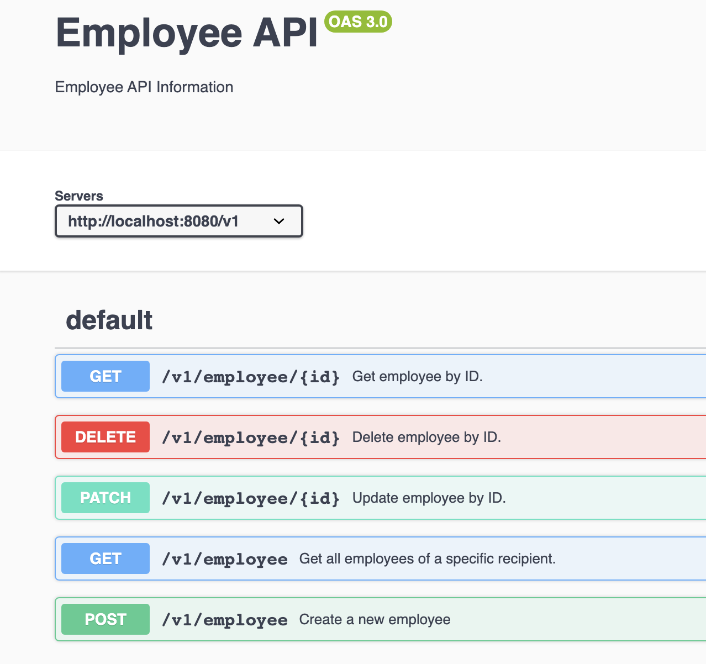

# Employee API README

This README provides documentation for the Employee API, including its controllers and routes.

### Swagger Documentation

Preview of the api in Swagger UI



## Usage

    git clone git@github.com:mitekk/clar-sagiweizmann.git
    cd clar-sagiweizmann
    npm install
    cp .env.example .env


Run the server in development mode:

    npm run dev

Build the server for production:

    npm run build

Start the server in production mode:

    npm run start

Run Unit Tests:

```
npm run test:unit
```

Run Unit Tests:

```
npm run test:integration
```

## Table of Contents
- [Employee Controller Functions](#controllers)
    - [getEmployee](#getemployee)
    - [getAllEmployee](#getallemployee)
    - [createEmployee](#createemployee)
    - [deleteEmployee](#deleteemployee)
    - [patchEmployee](#patchemployee)
- [Routes](#routes)
    - [GET /v1/employee/:id - Get Employee by ID](#get-employee-by-id)
    - [GET /v1/employee - Get All Employees](#get-all-employees)
    - [POST /v1/employee - Create a New Employee](#create-a-new-employee)
    - [DELETE /v1/employee/:id - Delete Employee by ID](#delete-employee-by-id)
    - [PATCH /v1/employee/:id - Update Employee by ID](#update-employee-by-id)

---

## Controllers

### `getEmployee`
- **Description:** Retrieves a specific employee by their ID.
- **Parameters:**
    - `req`: The request object.
    - `res`: The response object.
    - `next`: The next middleware function.
- **Response:**
    - HTTP Status Code: 200 OK if successful, 404 Not Found if employee not found.
    - JSON Response:
        - `employee`: The retrieved employee object.

### `getAllEmployee`
- **Description:** Retrieves all employees of a specific recipient.
- **Parameters:**
    - `req`: The request object.
    - `res`: The response object.
    - `next`: The next middleware function.
- **Response:**
    - HTTP Status Code: 200 OK if successful, 200 OK with an empty array if no employees found.
    - JSON Response:
        - `employees`: An array of employee objects.

### `createEmployee`
- **Description:** Creates a new employee.
- **Parameters:**
    - `req`: The request object containing the employee data.
    - `res`: The response object.
    - `next`: The next middleware function.
- **Response:**
    - HTTP Status Code: 201 Created if successful.
    - JSON Response:
        - `employee`: The newly created employee object.

### `deleteEmployee`
- **Description:** Deletes an employee by their ID.
- **Parameters:**
    - `req`: The request object.
    - `res`: The response object.
    - `next`: The next middleware function.
- **Response:**
    - HTTP Status Code: 200 OK if successful, 404 Not Found if employee not found.
    - JSON Response:
        - `message`: "Employee deleted."

### `patchEmployee`
- **Description:** Updates an employee by their ID with the fields provided in the request body.
- **Parameters:**
    - `req`: The request object containing the employee data to update.
    - `res`: The response object.
    - `next`: The next middleware function.
- **Response:**
    - HTTP Status Code: 200 OK if successful, 404 Not Found if employee not found.
    - JSON Response:
        - `employee`: The updated employee object.

---

## Routes

### Get Employee by ID
- **URL:** `/v1/employee/:id`
- **Method:** GET
- **Description:** Retrieves a specific employee by their ID.
- **Parameters:**
    - `id` (URL Parameter): Employee ID.
- **Response:**
    - HTTP Status Code: 200 OK if successful, 404 Not Found if employee not found.
    - JSON Response:
        - `employee`: The retrieved employee object.

### Get All Employees
- **URL:** `/v1/employee`
- **Method:** GET
- **Description:** Retrieves all employees of a specific recipient.
- **Parameters:**
    - `recipient` (Query Parameter): Employee recipient.
- **Response:**
    - HTTP Status Code: 200 OK if successful, 200 OK with an empty array if no employees found.
    - JSON Response:
        - `employees`: An array of employee objects.

### Create a New Employee
- **URL:** `/v1/employee`
- **Method:** POST
- **Description:** Creates a new employee.
- **Request Body:**
    - `recipient`: Employee recipient.
    - `employee`: Employee content.
    - `sender`: Employee sender.
- **Response:**
    - HTTP Status Code: 201 Created if successful.
    - JSON Response:
        - `employee`: The newly created employee object.

### Delete Employee by ID
- **URL:** `/v1/employee/:id`
- **Method:** DELETE
- **Description:** Deletes an employee by their ID.
- **Parameters:**
    - `id` (URL Parameter): Employee ID.
- **Response:**
    - HTTP Status Code: 200 OK if successful, 404 Not Found if employee not found.
    - JSON Response:
        - `message`: "Employee deleted."

### Update Employee by ID
- **URL:** `/v1/employee/:id`
- **Method:** PATCH
- **Description:** Updates an employee by their ID with the fields provided in the request body.
- **Parameters:**
    - `id` (URL Parameter): Employee ID.
- **Request Body:** The fields of the employee to update.
- **Response:**
    - HTTP Status Code: 200 OK if successful, 404 Not Found if employee not found.
    - JSON Response:
        - `employee`: The updated employee object.

---

This API provides basic CRUD (Create, Read, Update, Delete) operations for managing employee data. Ensure that you have appropriate error handling and validation in place as per your application's requirements.
